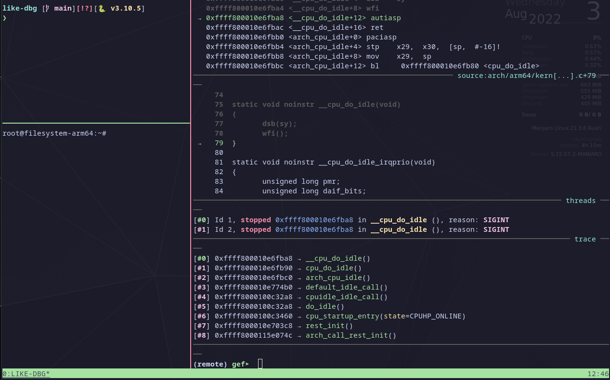

# LIKE-DBG

[](https://github.com/psf/black)
[](https://github.com/0xricksanchez/like-dbg/actions?query=workflow%3Aflake8)
[](https://github.com/0xricksanchez/like-dbg/actions?query=workflow%3Ashellcheck)
[](https://github.com/0xricksanchez/like-dbg/actions?query=workflow%3Ahadolint)
[](https://tldrlegal.com/license/mit-license)
[](https://github.com/0xricksanchez/like-dbg/releases/)  

LIKE-DBG (*LI*nux-*KE*rnel-*D*e*B*u*G*ger) aims at automating the boring steps when trying to set up a Linux kernel debugging environment.
I set out to dive into kernel exploitation research and found existing solutions not usable enough.
Hence, this is an attempt at making all necessary pre-steps before one can even think about diving into research as painless and fun as possible.
All steps from building a kernel, running it inside an emulated environment, and attaching a debugger are transparently done inside docker containers to keep system requirements minimal.
Currently, there's a dedicated docker container for every of the following steps:

* Building the kernel
* Creating a root file system to use with the kernel
* Launching the kernel + file system as the *debuggee*
* Attaching to the kernel as a *debugger*

## Caveats

As this project is in its early stages, I expect things to change rapidly, while also introducing breaking changes along the way.
Major points to improve on are:

* Getting towards true multi-architecture support beyond `x86_64` and `arm64`
* Extend kernel builder to not only succeed in building recent™ kernels
* Add android kernel support
* Add (integration) tests
* Elevate the debugging experience even more

## Features

On the upside, despite its early stages, a couple of useful features are already present:

* General:
  * Minimal host system requirements due to dockerization of every step
  * A single config (`config.ini`) to allow free customization
  * CTF runner that's specifically designed to handle Linux kernel exploitation challenges
  * Code quality measures:
    * [black](https://github.com/psf/black) formatter for python code
    * [flake8](https://github.com/PyCQA/flake8) linter for all python code
    * [shellcheck](https://github.com/koalaman/shellcheck) linter for shell scripts
    * [hadolint](https://github.com/hadolint/hadolint) linter for the Dockerfiles
* Kernel builder:
  * Multi-arch: `x86_64`, `arm64`
  * Choose between `gcc` and `clang` to build the kernel
  * Configuration modes:
    * generic-mode
    * syzkaller-mode
    * custom-mode
  * Fine-granular version control to build from:
    * Commit hash
    * Release tag (e.g.: 5.10-rc)
    * Major-Minor-Patch (e.g.: 5.10.77)
  * Ability to automatically apply patch files
* Root file system builder:
  * Powered by [debootstrap](https://wiki.debian.org/Debootstrap)
  * Automatic generation of file system that matches the kernels architecture
  * Ability to customize:
    * wanted packages in the file system
    * the Debian release version to base everything on
* Debuggee:
  * Powered by [QEMU](https://github.com/qemu/qemu)
  * Customization of QEMU runtime options from within the `config.ini`:
* Debugger:
  * Powered by [GDB (multiarch)](https://sourceware.org/gdb/) + [GEF](https://github.com/hugsy/gef) and [GEF-extras](https://github.com/hugsy/gef-extras)
  * Allow users to specify GDB script in `io/scripts/gdb_script` to allow a scenario-tailored debugging experience

## Requirements

To get started, you have to ensure to have the following requirements set up in your system:

* `docker`
* `tmux`
* `python>=3.9`
  * `venv`

## Configuration

Fine-tuning the kernel debugging experience is one of the goals of this project.
Currently, all tunable options are exposed in the `config.ini`.
Some fields are recommended to not be altered as they're mainly for development reasons.
However, all the ones to customize the environment to your needs should be self-explanatory as all of them are labeled with a brief comment.

## Usage

Once you're set with the configuration, the usage depends on your scenario.

```sh
tmux -f .tmux.conf
python3 -m venv .like-dbg
source .like-dbg/bin/activate
python3 -m pip install --upgrade pip
python3 -m pip install -r requirements.txt
# If you want to build a Linux kernel image from scratch for a specific version to debug, go ahead and run:
./start_kgdb.py
# If you want to try a CTF challenge where you were given a compressed Linux Image and a root filesystem try:
./start_kgdb.py --ctf --env <Image> <RootFS>
```

## Showcase

As a first-time user, you will see a lot of docker building messages race across the screen.
In the end, your experience should look similar to this:



## Hacking

The python code should be quite readable, so feel free to extend the project with your own ideas. All PRs are very much welcome :)!
Otherwise, feel free to create a feature-request issue or head over to the [discussions page](https://github.com/0xricksanchez/like-dbg/discussions) to brainstorm some cool new features!

PS: If you want to provide a logo, feel free to do so.
