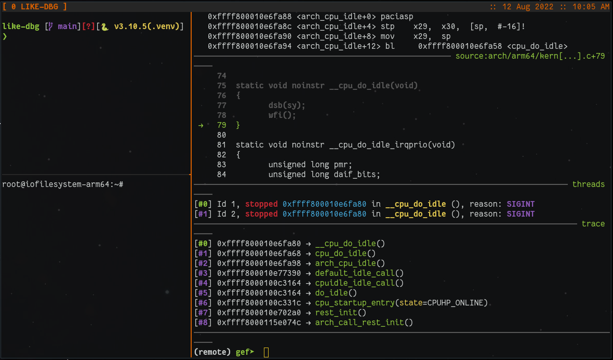

# LInux-KErnel DeBuGger (LIKE-DBG) 

**VERY MUCH IN POC WIP STATE**

This repository aims at automating the boring steps when trying to set up a Linux kernel debugging environment.
All steps from building the kernel to running the kernel and attaching the debugger are transparently done inside docker containers to keep system requirements minimal.
Currently there's a dedicated docker container for every step:

* Building the kernel
* Creating a root file system to use with the earlier build kernel
* A debuggee container that launches QEMU with our custom kernel + rootfs
* A debug container that houses the debugging logic

**Note**: Currently only *x86_64* and *arm64* Linux kernel builds are supported

## Requirements

* `docker` (may work with `podman` as well)
* `tmux`
* `python>=3.7`


## Configuration

All the steps from *building the kernel* to *running the kernel* and *attaching the debugger* are configured via the `config.ini`.
Some fields should not be altered but in general the fields that can be tweaked by the user should be self explanatory.

Once you're set executing the commands below should drop you into a 3-tile tmux configuration with a booted kernel in QEMU, an attached
GDB debugger, and one terminal for free allocation:

```bash
tmux
python3 -m venv .like-dbg
source .like-dbg/bin.activate
python3 ./start_kgdb.py
```

## Showcase


